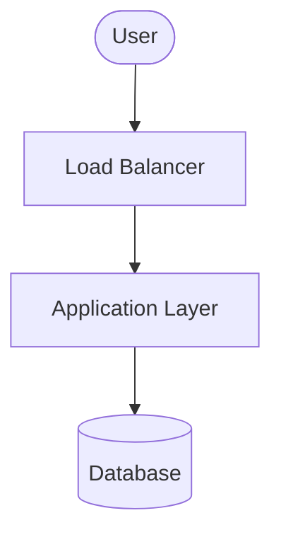

<!-- Use this template to compile the content that you generate based on the
instructions in `SKILL.md`. -->

# Google Cloud solution architecture: Live bidirectional multimodal streaming agentic AI solution

## 1. Executive summary and workload overview

[A brief description of the workload, its business goals, and the high-level
solution architecture proposed.]

## 2. Requirements and current state

### 2.1. Functional requirements

* **Business processes**: [Details of the business processes supported]
* **Activities and use cases**: [Details of the key activities and use cases]

### 2.2. Non-functional requirements

* **Security**: [Details of the security requirements including compliance,
  encryption, access control requirements]
* **Reliability**: [Details of the reliability requirements including SLA,
  RTO/RPO, backup, redundancy requirements]
* **Cost**: [Details of the cost constraints and pricing models]
* **Operations**: [Details of the operational requirements including
  monitoring, logging, deployment, maintenance requirements]
* **Performance**: [Details of the performance requirements including latency,
  throughput, scaling requirements]
* **Sustainability**: [Details of the sustainability requirements including
  carbon footprint, resource optimization requirements]

### 2.3. Current state

[If applicable, describe the current on-premises or other-cloud architecture.]

* **Current infrastructure**: [Details of existing setup]
* **Pain points and drivers for migration/redesign**: [Details of the drivers
  for migration/redesign]

### 2.4. Dependencies

* **Internal dependencies**: [Details of internal dependencies including other
  workloads and internal services]
* **External dependencies**: [Details of external dependencies including
  third-party products and on-premises tools]

## 3. Technical decomposition of the workload

[Technical decomposition of the workload components, breaking down the
application into logical services or layers.]

## 4. Proposed solution architecture

### 4.1. Google Cloud products and features mapping

[Identify Google Cloud products and features mapped to the technical
components. For each component, justify the selection, note alternatives
considered, and describe the pros and cons of the recommended product/feature
and alternatives.]

| Component | Recommended Google Cloud product/feature | Justification and citations | Alternatives considered | Pros and cons of alternatives |
| :--- | :--- | :--- | :--- | :--- |
| **[Component Name Details (e.g. Frontend)]** | **[Product Name (e.g. Cloud Run)]** | [Why this product is chosen, citing official docs] | [Alternative product (e.g. Firebase App Hosting)] | **Pros**: Automated builds and deployment pipeline from GitHub, optimized for modern framework integrations. <br> **Cons**: Less control over container configurations, limits customization of low-level networking. |

### 4.2. Architecture diagram

[Architecture diagram in Mermaid format showing the relationships and flows
between the components of the architecture.]



### 4.3. Architecture description

[Detailed description of the architecture. Describe the task flow and data
flow between the components of the architecture.]

* **Data flow**: [Describe the flow of data.]
* **Tasks/control flow**: [Describe the flow of tasks/control.]

## 5. Design and configuration recommendations

[Best practices and configuration recommendations for each pillar of the
Google Cloud Architecture Framework.]

### 5.1. Security, privacy, and compliance

* **Access control**: [E.g., Disable default run.app URL, configure regional external Application Load Balancer with Cloud Armor for request filtering, rate limiting, and DDoS protection]
* **Data protection**: [E.g., Enforce TLS encryption for bidirectional WebSocket connections to protect sensitive audio/video data, IAM least privilege policies]
* **Agent-to-Agent Security**: [E.g., Extended agent cards with OIDC identity tokens for Agent2Agent (A2A) authentication]
* **Human oversight**: [E.g., Human-in-the-loop flows to let supervisors monitor, pause, and override business-critical agent actions]

### 5.2. Reliability

* **Agent architecture**: [E.g., Fault-tolerant agents with decentralized designs]
* **Staging and validation**: [E.g., Simulate inter-agent coordination issues in replica staging environment]
* **High availability and quota**: [E.g., Regional multi-zone Cloud Run deployment, Provisioned Throughput for critical production model workloads]

### 5.3. Operational excellence

* **Monitoring and logging**: [E.g., Structured agent logs routed to Cloud Logging]
* **Tracing**: [E.g., Cloud Trace and trace visualizers for agent reasoning loops and execution paths]
* **Continuous evaluation & tooling**: [E.g., Agent Evaluation on Gemini Enterprise Agent Platform or ADK evaluation methodologies, MCP Database Toolbox for connection scaling policies]

### 5.4. Cost optimization

* **Data ingestion**: [E.g., Low-frequency frame sampling and Base64 JPEG video compression]
* **Token optimization**: [E.g., Context caching for long system prompts/static lookup databases, structured prompts for concise responses]
* **Model selection**: [E.g., Starting with smaller models like Gemini Flash and upgrading to Gemini Pro for complex reasoning]

### 5.5. Performance efficiency

* **Media processing & buffering**: [E.g., Asynchronous FIFO buffer decoupling incoming audio/video packets from model inference engine]
* **Low-latency storage**: [E.g., In-memory Memorystore for Redis Cluster for agent schematic vault]
* **Compute sizing**: [E.g., Fine-tuning Cloud Run memory and CPU limits based on live workloads]

### 5.6. Sustainability

* **Model routing**: [E.g., Route simpler tasks to small language models (SLMs) to minimize inference footprint]
* **Serverless scaling**: [E.g., Cloud Run native autoscaling to scale compute runtimes down to zero during idle periods]

## 6. Deployment guidance

[Instructions and code for deploying the architecture.]

### 6.1. Deployment prerequisites

* [Prerequisite 1: E.g., Enabling APIs]
* [Prerequisite 2: E.g., Installing SDK/tools]
* ...and so on

### 6.2. Step-by-step deployment instructions

1. [Step 1: E.g., Authenticate with Google Cloud]
2. [Step 2: E.g., Initialize Terraform]
3. [Step 3: E.g., Apply Terraform configuration]

## 7. Validation report

[Instructions and code for verifying that the deployed infrastructure meets the
workload requirements.]

### 7.1. Validation checks

* **Deployment dry-run**: [E.g., Running terraform plan to preview
  infrastructure changes]
* **Connectivity and routing**: [E.g., Verifying VPC egress routing, load
  balancer service endpoints, and database connection state]
* **Security policies**: [E.g., Checking IAM role constraints on the agent
  service accounts and verifying firewall rules]

### 7.2. Verification scripts

[Lightweight command-line checks or script configurations or cURL/gcloud
commands to validate the deployed environment.]

* **Execution script 1**:
  ```bash
  # E.g., Script to test agent connectivity and endpoint response
  ```
* **Execution script 2**:
  ```bash
  # E.g., Script to verify IAM permissions and service mappings
  ```

## 8. References

* [Enable live bidirectional multimodal streaming](https://docs.cloud.google.com/architecture/agentic-ai-bidirectional-multimodal-streaming.md.txt)
* [Choose your agentic AI architecture components](https://docs.cloud.google.com/architecture/choose-agentic-ai-architecture-components.md.txt)
* [Multi-agent AI system in Google Cloud](https://docs.cloud.google.com/architecture/multiagent-ai-system.md.txt)
* [Choose a design pattern for your agentic AI system](https://docs.cloud.google.com/architecture/choose-design-pattern-agentic-ai-system.md.txt)
* [Multi-agent private networking patterns in Google Cloud](https://docs.cloud.google.com/architecture/multi-agent-private-networking-patterns.md.txt)
* [Host AI agents on Cloud Run](https://docs.cloud.google.com/run/docs/ai-agents)
* [Triggering Cloud Run with WebSockets](https://docs.cloud.google.com/run/docs/triggering/websockets)
* [Start and Manage a Gemini Live API Session](https://docs.cloud.google.com/gemini-enterprise-agent-platform/models/live-api/start-manage-session)
* [ADK Streaming Tools](https://adk.dev/streaming/streaming-tools/)
* [ADK Streaming Configuration](https://adk.dev/streaming/configuration/)
* [Codelab: Way Back Home Level 4 instructions](https://codelabs.developers.google.com/way-back-home-level-4/instructions#0)
