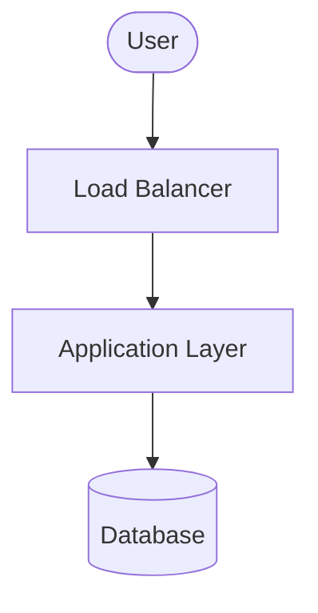

<!-- Use this template to compile the content that you generate based on the
instructions in `SKILL.md`. -->

# Google Cloud solution architecture: Borderless open data lakehouse agentic AI system

## 1. Executive summary and workload overview
[A brief description of the workload, its business goals, and the high-level
solution architecture proposed.]

## 2. Requirements and current state

### 2.1. Functional requirements

* **Business processes**: [Details of the business processes supported]
* **Activities and use cases**: [Details of the key activities and use cases]

### 2.2. Non-functional requirements

* **Security**: [Details of the security requirements including compliance,
  encryption, access control requirements]
* **Reliability**: [Details of the reliability requirements including SLA,
  RTO/RPO, backup, redundancy requirements]
* **Cost**: [Details of the cost constraints and pricing models]
* **Operations**: [Details of the operational requirements including
  monitoring, logging, deployment, maintenance requirements]
* **Performance**: [Details of the performance requirements including latency,
  throughput, scaling requirements]
* **Sustainability**: [Details of the sustainability requirements including
  carbon footprint, resource optimization requirements]

### 2.3. Current state

[If applicable, describe the current on-premises or other-cloud architecture.]

* **Current infrastructure**: [Details of existing setup]
* **Pain points and drivers for migration/redesign**: [Details of the drivers
  for migration/redesign]

### 2.4. Dependencies

* **Internal dependencies**: [Details of internal dependencies including other
  workloads and internal services]
* **External dependencies**: [Details of external dependencies including
  third-party products and on-premises tools]

## 3. Technical decomposition of the workload
[Technical decomposition of the workload components, breaking down the
application into logical services or layers.]

## 4. Proposed solution architecture

### 4.1. Google Cloud products and features mapping
[Identify Google Cloud products and features mapped to the technical
components. For each component, justify the selection, note alternatives
considered, and describe the pros and cons of the recommended product/feature
and alternatives.]

| Component | Recommended Google Cloud product/feature | Justification and citations | Alternatives considered | Pros and cons of alternatives |
| :--- | :--- | :--- | :--- | :--- |
| **[Component Name Details (e.g. Central metadata and governance)]** | **[Product Name (e.g. Lakehouse for Apache Iceberg)]** | [Why this product is chosen, citing official docs] | [Alternative product (e.g. Dataproc Metastore)] | **Pros**: Better for legacy open-source heavy pipelines.   **Cons**: Can have lower performance for borderless federation and Apache Iceberg. |

### 4.2. Architecture diagram
[Architecture diagram in Mermaid format showing the relationships and flows
between the components of the architecture. Show the data ingestion subsystem
and the serving subsystem, with Managed Service for Apache Spark bridging them.]

### 4.3. Architecture description
[Detailed description of the architecture. Describe the task flow and data
flow between the components of the architecture.]

* **Data flow**: [Describe the flow of data.]
* **Tasks/control flow**: [Describe the flow of tasks/control.]

## 5. Design and configuration recommendations
[Best practices and configuration recommendations for each pillar of the
Google Cloud Architecture Framework.]

### 5.1. Security, privacy, and compliance

* **Access control**: [E.g., IAM roles, least privilege policy, credential vending for Lakehouse Iceberg catalog]
* **Data protection**: [E.g., Sensitive Data Protection for prompts and responses, system-managed identities]
* **Network Security**: [E.g., Cloud NAT, Cloud Router for private subnets, BigQuery Cloud resource connections]

### 5.2. Reliability

* **Network reliability**: [E.g., Cross-Cloud Interconnect for private connections, redundant connections in active/active design]
* **Traffic routing**: [E.g., Cloud DNS routing policies, regional load balancers]

### 5.3. Operational excellence

* **Network administration**: [E.g., Dedicated transit VPC for external connections, bidirectional DNS forwarding]
* **Infrastructure as Code (IaC)**: [E.g., Terraform for heterogeneous resources]

### 5.4. Cost optimization

* **Direct querying**: [E.g., BigQuery federated queries to AlloyDB, reducing CDC pipeline overhead]
* **Network routing**: [E.g., Standard Network Service Tier for outbound internet traffic]

### 5.5. Performance efficiency

* **Model grounding**: [E.g., Grounding models on unified data profiles to mitigate hallucinations]
* **Query optimization**: [E.g., BigQuery federated queries for exact-match filters, Managed Service for Apache Spark with Lightning Engine for vectorized borderless joins]
* **Network performance**: [E.g., Cross-Cloud Interconnect, ECMP routing, selecting geographically close GCP/CSP regions]

### 5.6. Sustainability

* **Compute efficiency**: [E.g., Managed Service for Apache Spark with Lightning Engine for complex windowing and massive joins]
* **Querying in place**: [E.g., BigQuery Omni querying in place to avoid borderless replication]

## 6. References

* [Build hybrid and borderless architectures using Google Cloud](https://docs.cloud.google.com/architecture/hybrid-multicloud-patterns/one-page-view.md.txt)
* [Build a borderless open data lakehouse](https://docs.cloud.google.com/architecture/agentic-ai-build-multicloud-open-data-lakehouse.md.txt)
* [Implement agentic analytics workflows for distributed data](https://docs.cloud.google.com/architecture/agentic-ai-cross-cloud-analytics.md.txt)
* [Analytics Hybrid and Multicloud Pattern](https://docs.cloud.google.com/architecture/hybrid-multicloud-patterns-and-practices/analytics-hybrid-multicloud-pattern.md.txt)
* [Google Cloud multi-regional deployment archetype](https://docs.cloud.google.com/architecture/deployment-archetypes/multiregional.md.txt)
* [Network segmentation and connectivity for distributed applications in Cross-Cloud Network](https://docs.cloud.google.com/architecture/ccn-distributed-apps-design/connectivity.md.txt)
* [Patterns for Connecting Other Cloud Service Providers with Google Cloud](https://docs.cloud.google.com/architecture/patterns-for-connecting-other-csps-with-gcp.md.txt)
