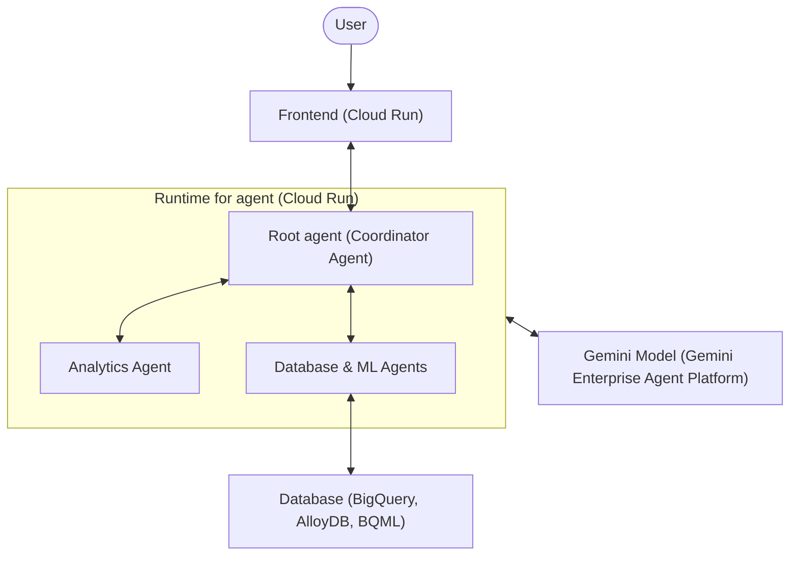

<!-- Use this template to compile the content that you generate based on the
instructions in `SKILL.md`. -->

# Google Cloud solution architecture: Data science workflow with AI agents

## 1. Executive summary and workload overview

[A brief description of the workload, its business goals, and the high-level
solution architecture proposed.]

## 2. Requirements and current state

### 2.1. Functional requirements

* **Business processes**: [Details of the business processes supported]
* **Activities and use cases**: [Details of the key activities and use cases]

### 2.2. Non-functional requirements

* **Security**: [Details of the security requirements including compliance,
  encryption, access control requirements]
* **Reliability**: [Details of the reliability requirements including SLA,
  RTO/RPO, backup, redundancy requirements]
* **Cost**: [Details of the cost constraints and pricing models]
* **Operations**: [Details of the operational requirements including
  monitoring, logging, deployment, maintenance requirements]
* **Performance**: [Details of the performance requirements including latency,
  throughput, scaling requirements]
* **Sustainability**: [Details of the sustainability requirements including
  carbon footprint, resource optimization requirements]

### 2.3. Current state

[If applicable, describe the current on-premises or other-cloud architecture.]

* **Current infrastructure**: [Details of existing setup]
* **Pain points and drivers for migration/redesign**: [Details of the drivers
  for migration/redesign]

### 2.4. Dependencies

* **Internal dependencies**: [Details of internal dependencies including other
  workloads and internal services]
* **External dependencies**: [Details of external dependencies including
  third-party products and on-premises tools]

## 3. Technical decomposition of the workload

[Technical decomposition of the workload components, breaking down the
application into logical services or layers.]

## 4. Proposed solution architecture

### 4.1. Google Cloud products and features mapping

[Identify Google Cloud products and features mapped to the technical
components. For each component, justify the selection, note alternatives
considered, and describe the pros and cons of the recommended product/feature
and alternatives.]

| Component | Recommended Google Cloud product/feature | Justification and
citations | Alternatives considered | Pros and cons of alternatives |
| :--- |:--- | :--- | :--- | :--- |
| **[Component Name]** | **[Product Name]** | [Why
this product is chosen, citing official docs] | [Alternative product] |
**Pros**: ... <br> **Cons**: ... |

### 4.2. Architecture diagram
[Architecture diagram in Mermaid format showing the relationships and flows
between the components of the architecture.]



### 4.3. Architecture description
[Detailed description of the architecture. Describe the task flow and data
flow between the components of the architecture.]

* **Data flow**: [Describe the flow of data.]
* **Tasks/control flow**: [Describe the flow of tasks/control.]

## 5. Design and configuration recommendations
[Best practices and configuration recommendations for each pillar of the
Google Cloud Architecture Framework.]

### 5.1. Security, privacy, and compliance

* **Access control and safety**: [E.g., Least-privilege agent IAM roles, Model
  Armor prompt/response sanitization]
* **Data protection**: [E.g., Secret Manager for credentials, Cloud Data Loss
  Prevention API for sensitive data]
* **Network security**: [E.g., Cloud Run Direct VPC egress, private VPC IPs,
  regional external Application Load Balancer with Cloud Armor]

### 5.2. Reliability

* **Agent and runtime robustness**: [E.g., Coordinator agent fallback logic,
  graceful error handling for SQL/code execution failures]
* **Scale and rate-limit management**: [E.g., Exponential backoff with retries
  for 429 errors, provisioned model throughput settings]
* **Execution limits and redundancy**: [E.g., Query timeouts, memory/CPU caps on
  generated code, multi-zone Cloud Run deployment]

### 5.3. Operational excellence

* **Monitoring and logging**: [E.g., Structured agent logs routed to Cloud
  Logging, tracing inter-agent communication via Cloud Trace / OpenTelemetry]
* **Environment isolation**: [E.g., Sandboxed python code execution,
  containerized Cloud Run runtimes]

### 5.4. Cost optimization

* **Resource sizing and scaling**: [E.g., Cloud Run autoscaling to zero for idle
  environments, context caching for high input tokens]
* **Tiered model strategy**: [E.g., Routing simple SQL/logical tasks to Gemini
  Flash and reserving Gemini Pro for complex reasoning]

### 5.5. Performance efficiency

* **Database and connectivity performance**: [E.g., Cloud Run Direct VPC egress
  with connection pooling to reduce latency]
* **Processing and visualization**: [E.g., Aggregating data at the database
  level, returning summarized results or charts instead of raw data]

### 5.6. Sustainability

* **Resource utilization**: [E.g., Scaling down dev databases during idle hours,
  serverless Cloud Run adoption]
* **Carbon-free deployment**: [E.g., Selecting Google Cloud regions with high
  Carbon-Free Energy (CFE) metrics or low CO2 indicators]

## 6. Deployment guidance
[Instructions and code for deploying the architecture.]

### 6.1. Deployment prerequisites

* [Prerequisite 1: E.g., Enabling APIs]
* [Prerequisite 2: E.g., Installing SDK/tools]
* ...and so on

### 6.2. Step-by-step deployment instructions

1. [Step 1: E.g., Authenticate with Google Cloud]
2. [Step 2: E.g., Initialize Terraform]
3. [Step 3: E.g., Apply Terraform configuration]

## 7. Validation report
[Instructions and code for verifying that the deployed infrastructure meets the
workload requirements.]

### 7.1. Validation checks

* **Deployment dry-run**: [E.g., Running terraform plan to preview
  infrastructure changes]
* **Connectivity and routing**: [E.g., Verifying VPC egress routing, load
  balancer service endpoints, and database connection state]
* **Security policies**: [E.g., Checking IAM role constraints on the agent
  service accounts and verifying firewall rules]

### 7.2. Verification scripts
[Lightweight command-line checks or script configurations or cURL/gcloud
commands to validate the deployed environment.]

* **Execution script 1**:
  ```bash
  # E.g., Script to test agent connectivity and endpoint response
  ```
* **Execution script 2**:
  ```bash
  # E.g., Script to verify IAM permissions and service mappings
  ```

## 8. References

* [Data science workflow with AI agents](https://docs.cloud.google.com/architecture/agentic-ai-data-science.md.txt)
* [ADK Data Science Sample Code](https://github.com/google/adk-samples/tree/main/python/agents/data-science)
* [Multi-agent AI system in Google Cloud](https://docs.cloud.google.com/architecture/multiagent-ai-system.md.txt)
* [Choose your agentic AI architecture components](https://docs.cloud.google.com/architecture/choose-agentic-ai-architecture-components.md.txt)
* [Choose a design pattern for your agentic AI system](https://docs.cloud.google.com/architecture/choose-design-pattern-agentic-ai-system.md.txt)
* [Build and deploy an AI agent to Cloud Run using ADK](https://docs.cloud.google.com/run/docs/ai/build-and-deploy-ai-agents/deploy-adk-agent.md.txt)
* [Use AlloyDB with agents](https://docs.cloud.google.com/alloydb/docs/connect-ide-using-mcp-toolbox.md.txt)
* [MCP Toolbox for Databases Configuration](https://mcp-toolbox.dev/documentation/configuration/)