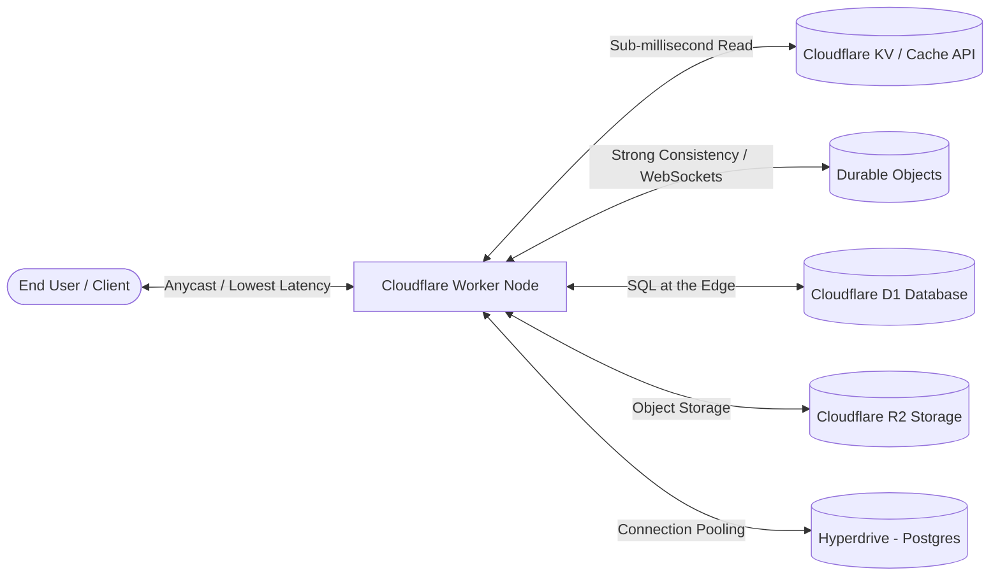

# Cloudflare Workers & Edge Computing Skill Guide

This skill covers end-to-end edge application development, state management, latency optimization, and infrastructure integration using Cloudflare Workers, Cloudflare D1, KV, R2, Durable Objects, Hyperdrive, and Vectorize.

---

## 1. Edge Architecture Overview & Storage Topology



### Storage Selection Matrix

| Storage Service | Consistency Model | Ideal Use Case | Read Latency | Write Latency |
| :--- | :--- | :--- | :--- | :--- |
| **Workers KV** | Eventual Consistency | Global read-heavy config, feature flags, static assets | Low (edge-cached) | High (propagation delay) |
| **Durable Objects** | Single-location Strict Serializability | Real-time collaboration, rate limiting, WebSockets, stateful coordination | Ultra-low (local) | Ultra-low (local) |
| **Cloudflare D1** | SQLite / Asynchronous Replication | Relational web app data, blog databases, user metadata | Edge-local read | Regional write |
| **Hyperdrive** | Regional DB proxying + Caching | Fast connection pooling for existing cloud PostgreSQL (AWS RDS, Neon, Supabase) | Accelerated connection | Origin dependent |

---

## 2. Standard Project Structure (`wrangler.jsonc` + Hono + TypeScript)

```text
edge-service/
├── src/
│   ├── index.ts           # Worker entry point (Hono API routes)
│   ├── durable/           # Durable Object classes
│   │   └── CounterDO.ts
│   ├── services/          # Business logic & bindings encapsulation
│   │   ├── db.ts          # D1 ORM / Drizzle integration
│   │   └── storage.ts     # R2 / KV helpers
│   └── types.ts           # Env bindings & domain types
├── test/                  # Vitest + Miniflare tests
│   └── index.spec.ts
├── drizzle.config.ts      # D1 Drizzle migrations config
├── package.json
├── tsconfig.json
└── wrangler.jsonc         # Cloudflare Worker configuration
```

---

## 3. Production Configuration (`wrangler.jsonc`)

```jsonc
{
  "$schema": "node_modules/wrangler/config-schema.json",
  "name": "edge-api-service",
  "main": "src/index.ts",
  "compatibility_date": "2026-03-01",
  "compatibility_flags": ["nodejs_compat"],

  // KV Namespace Bindings
  "kv_namespaces": [
    {
      "binding": "CACHE_KV",
      "id": "abc1234567890def1234567890def123"
    }
  ],

  // D1 Relational Database Bindings
  "d1_databases": [
    {
      "binding": "DB",
      "database_name": "production-db",
      "database_id": "00000000-0000-0000-0000-000000000000"
    }
  ],

  // Durable Objects Bindings
  "durable_objects": {
    "bindings": [
      {
        "name": "RATE_LIMITER",
        "class_name": "RateLimiterDO"
      }
    ]
  },

  // Migrations for Durable Objects
  "migrations": [
    {
      "tag": "v1",
      "new_classes": ["RateLimiterDO"]
    }
  ],

  // Observability & Tail Logs
  "observability": {
    "enabled": true,
    "head_sampling_rate": 1.0
  }
}
```

---

## 4. Production Application Logic (Hono + Durable Objects + D1)

```typescript
// src/index.ts
import { Hono } from 'hono';
import { cors } from 'hono/cors';
import { logger } from 'hono/logger';

export interface Env {
  CACHE_KV: KVNamespace;
  DB: D1Database;
  RATE_LIMITER: DurableObjectNamespace;
}

// Export Durable Object class
export { RateLimiterDO } from './durable/RateLimiterDO';

const app = new Hono<{ Bindings: Env }>();

app.use('*', logger());
app.use('/api/*', cors());

// Middleware: Durable Object Edge Rate Limiter
app.use('/api/*', async (c, next) => {
  const clientIp = c.req.header('cf-connecting-ip') || 'anonymous';
  const id = c.env.RATE_LIMITER.idFromName(clientIp);
  const stub = c.env.RATE_LIMITER.get(id);

  const res = await stub.fetch('http://do/check');
  if (res.status === 429) {
    return c.json({ error: 'Too Many Requests' }, 429);
  }

  await next();
});

// Endpoint: Read with KV Layering + D1 Fallback
app.get('/api/users/:id', async (c) => {
  const userId = c.req.param('id');
  const cacheKey = `user:${userId}`;

  // 1. Check KV Cache
  const cachedUser = await c.env.CACHE_KV.get(cacheKey, { type: 'json' });
  if (cachedUser) {
    return c.json({ source: 'kv-cache', data: cachedUser });
  }

  // 2. Query D1 Relational DB
  const user = await c.env.DB.prepare('SELECT id, name, email, created_at FROM users WHERE id = ?')
    .bind(userId)
    .first();

  if (!user) {
    return c.json({ error: 'User Not Found' }, 404);
  }

  // 3. Populate Cache with TTL (300 seconds)
  await c.env.CACHE_KV.put(cacheKey, JSON.stringify(user), { expirationTtl: 300 });

  return c.json({ source: 'd1-database', data: user });
});

export default app;
```

### Stateful Durable Object Implementation (`src/durable/RateLimiterDO.ts`)

```typescript
import { DurableObject } from 'cloudflare:workers';

export class RateLimiterDO extends DurableObject {
  private count: number = 0;
  private lastReset: number = Date.now();

  async fetch(request: Request): Promise<Response> {
    const now = Date.now();
    
    // Reset window every 60 seconds
    if (now - this.lastReset > 60_000) {
      this.count = 0;
      this.lastReset = now;
    }

    this.count++;

    if (this.count > 100) {
      return new Response('Rate Limit Exceeded', { status: 429 });
    }

    return new Response('OK', { status: 200 });
  }
}
```

---

## 5. Testing Edge Workers (Vitest + `@cloudflare/vitest-pool-workers`)

```typescript
// test/index.spec.ts
import { describe, it, expect } from 'vitest';
import { env, SELF } from 'cloudflare:test';

describe('Edge API Worker', () => {
  it('should return 404 for non-existent users', async () => {
    const res = await SELF.fetch('http://example.com/api/users/non-existent-id');
    expect(res.status).toBe(404);
    const json = await res.json();
    expect(json).toEqual({ error: 'User Not Found' });
  });

  it('should read from D1 and write to KV cache', async () => {
    // Seed D1 test database
    await env.DB.prepare('INSERT INTO users (id, name, email) VALUES (?, ?, ?)')
      .bind('user-1', 'Alice', 'alice@example.com')
      .run();

    // First fetch: D1 hit
    const res1 = await SELF.fetch('http://example.com/api/users/user-1');
    expect(res1.status).toBe(200);
    const json1 = await res1.json();
    expect(json1.source).toBe('d1-database');

    // Second fetch: KV cache hit
    const res2 = await SELF.fetch('http://example.com/api/users/user-1');
    expect(res2.status).toBe(200);
    const json2 = await res2.json();
    expect(json2.source).toBe('kv-cache');
  });
});
```

---

## 6. Anti-Patterns & Critical Pitfalls

| Anti-Pattern | Operational Risk | Production Remedy |
| :--- | :--- | :--- |
| **Using Global Variables for Per-Request State** | Global variables persist across warm worker invocations and bleed state between different concurrent user requests. | Store request context in request handlers or local state wrappers. Use Durable Objects for shared persistent state. |
| **Treating Workers KV like Redis/Transactions** | KV has eventual consistency. Writing to KV and reading immediately will lead to stale reads. | Use Durable Objects or Cloudflare D1 when strong read-after-write consistency is required. |
| **Unbounded Remote DB Fetching** | Creating raw TCP connections to remote Postgres/MySQL without connection pooling exhausts database sockets. | Use **Cloudflare Hyperdrive** or serverless HTTP/WebSocket drivers (Neon HTTP client, PlanetScale driver). |
| **Heavy NPM Node.js Dependencies** | Exceeds CPU runtime limits / script bundle size limits. | Use web standard APIs (`fetch`, `Crypto`, `Streams`) and lightweight edge-native libraries (Hono, Itty-router). |
