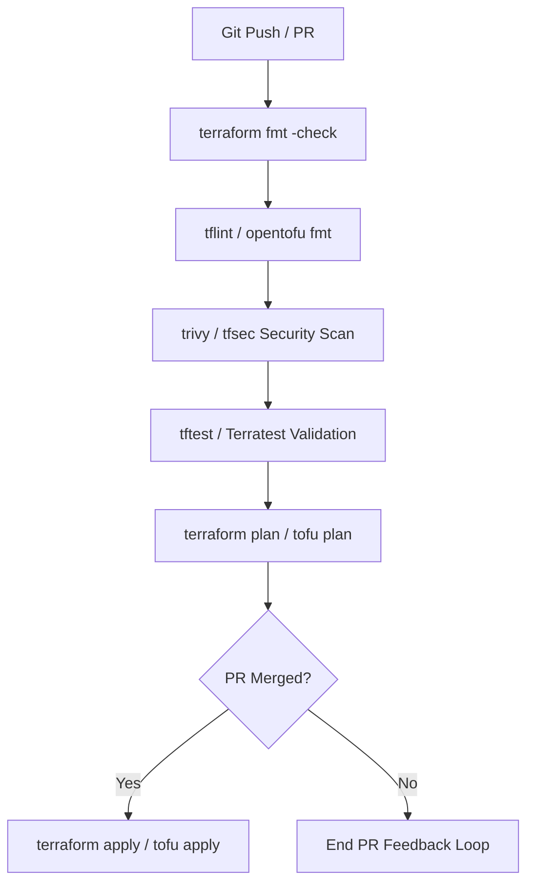

# Terraform & OpenTofu Module Architecture Skill Guide

This skill provides comprehensive standards, production patterns, anti-patterns, and actionable code guidelines for designing, building, testing, and maintaining modular Infrastructure as Code (IaC) using Terraform and OpenTofu.

---

## 1. Core Principles & Architecture Guidelines

1. **Strict Separation of Concerns**:
   - **Root Modules (Live/Environments)**: Instantiate reusable modules with environment-specific input values. Never contain resource declarations directly when reusable modules can be authored.
   - **Child Modules (Reusable Component)**: Abstract infrastructure resources into logical units (e.g., VPC, EKS/GKE, RDS/Cloud SQL). Must be environment-agnostic, parameter-driven, and highly composable.

2. **Standard Module Directory Structure**:
   ```text
   terraform-provider-name-modulename/
   ├── main.tf              # Primary resource definitions & orchestrations
   ├── variables.tf         # Typed input variables with defaults & validation rules
   ├── outputs.tf           # Explicit outputs with meaningful descriptions & types
   ├── versions.tf          # Required terraform/opentofu version & provider constraints
   ├── dependencies.tf      # Remote state data sources, provider bindings, or internal locals
   ├── README.md            # Auto-generated documentation (terraform-docs)
   ├── examples/            # Runnable implementations
   │   ├── complete/        # Fully featured environment setup
   │   └── minimal/         # Basic getting-started configuration
   └── tests/               # Automated unit/integration tests (Native / Terratest)
       ├── unit_test.tftest.hcl
       └── integration_test.tftest.hcl
   ```

3. **Immutability & State Management**:
   - Remote backend with explicit state locking (DynamoDB / S3, GCS, Cloudflare R2, or OpenTofu S3/HTTP backends).
   - Never share state files across separate environments or environments with different lifecycles; isolate by directory or repository (prefer directory-based layout over workspace-based layout for separate clouds/environments).

---

## 2. Production Code Standards & Examples

### A. Defensive Variable Definition & Validations (`variables.tf`)

Always define explicit types, descriptions, and custom validation blocks.

```hcl
variable "environment" {
  type        = string
  description = "Deployment environment name (e.g., dev, staging, prod)."

  validation {
    condition     = contains(["dev", "staging", "prod"], var.environment)
    error_message = "Allowed values for environment are 'dev', 'staging', or 'prod'."
  }
}

variable "vpc_cidr" {
  type        = string
  description = "IPv4 CIDR block for the VPC network."
  default     = "10.0.0.0/16"

  validation {
    condition     = can(cidrnetmask(var.vpc_cidr))
    error_message = "Must be a valid IPv4 CIDR notation (e.g., 10.0.0.0/16)."
  }
}

variable "subnet_configuration" {
  type = map(object({
    cidr_block        = string
    availability_zone = string
    public            = bool
    tags              = optional(map(string), {})
  }))
  description = "Map of subnets to create within the network module."

  validation {
    condition = alltrue([
      for sub in values(var.subnet_configuration) : can(cidrnetmask(sub.cidr_block))
    ])
    error_message = "All subnets must specify a valid IPv4 CIDR block."
  }
}
```

### B. Clean Resource Declarations & Local Conventions (`main.tf`)

Use `locals` to compute tag sets, naming conventions, and conditional configurations centrally.

```hcl
locals {
  name_prefix = "${var.project_name}-${var.environment}"
  
  default_tags = merge(
    var.tags,
    {
      Environment = var.environment
      ManagedBy   = "Terraform/OpenTofu"
      Project     = var.project_name
    }
  )
}

resource "aws_s3_bucket" "this" {
  bucket        = "${local.name_prefix}-data-store"
  force_destroy = var.environment == "dev" ? true : false

  tags = local.default_tags
}

resource "aws_s3_bucket_versioning" "this" {
  bucket = aws_s3_bucket.this.id

  versioning_configuration {
    status = var.enable_versioning ? "Enabled" : "Suspended"
  }
}

resource "aws_s3_bucket_server_side_encryption_configuration" "this" {
  bucket = aws_s3_bucket.this.id

  rule {
    apply_server_side_encryption_by_default {
      kms_master_key_id = var.kms_key_arn
      sse_algorithm     = var.kms_key_arn != null ? "aws:kms" : "AES256"
    }
  }
}
```

### C. Explicit Outputs (`outputs.tf`)

Always return full object references or specific attributes with explicit descriptions. Never leak unencrypted secrets unless explicitly intended (mark `sensitive = true`).

```hcl
output "bucket_id" {
  value       = aws_s3_bucket.this.id
  description = "The name/ID of the created S3 bucket."
}

output "bucket_arn" {
  value       = aws_s3_bucket.this.arn
  description = "The Amazon Resource Name (ARN) of the S3 bucket."
}

output "database_connection_string" {
  value       = "postgres://${aws_db_instance.this.username}:${aws_db_instance.this.password}@${aws_db_instance.this.endpoint}/${aws_db_instance.this.db_name}"
  description = "Full PostgreSQL connection string."
  sensitive   = true
}
```

---

## 3. Native OpenTofu & Terraform Testing Framework (`tests/`)

Use native `.tftest.hcl` test suites to validate logic without third-party dependencies.

```hcl
# tests/unit_test.tftest.hcl
run "verify_bucket_naming_and_tags" {
  command = plan

  variables {
    project_name      = "myproject"
    environment       = "dev"
    enable_versioning = true
    tags              = { CostCenter = "12345" }
  }

  assert {
    condition     = aws_s3_bucket.this.bucket == "myproject-dev-data-store"
    error_message = "S3 bucket name generated does not match expected convention."
  }

  assert {
    condition     = aws_s3_bucket.this.tags["ManagedBy"] == "Terraform/OpenTofu"
    error_message = "ManagedBy tag was not injected correctly."
  }
}

run "verify_production_encryption" {
  command = plan

  variables {
    project_name      = "myproject"
    environment       = "prod"
    kms_key_arn       = "arn:aws:kms:us-east-1:123456789012:key/abc-123"
    enable_versioning = true
  }

  assert {
    condition     = aws_s3_bucket_server_side_encryption_configuration.this.rule[0].apply_server_side_encryption_by_default[0].sse_algorithm == "aws:kms"
    error_message = "KMS encryption must be applied when kms_key_arn is provided."
  }
}
```

---

## 4. Anti-Patterns & Pitfalls

| Anti-Pattern | Why it Fails | Production Solution |
| :--- | :--- | :--- |
| **Hardcoding Provider Blocks in Child Modules** | Prevents module users from configuring custom regions, multi-region aliases, or authentication credentials. | Define `required_providers` in child modules; let root module pass providers via `providers = { aws = aws.eu_west_1 }`. |
| **Monolithic State Files** | Increases blast radius of `terraform destroy` or state corruptions; slows `terraform plan` execution down. | Break infrastructure into isolated layers (e.g., `0-network/`, `1-database/`, `2-apps/`). |
| **Overusing `count` for Complex Maps** | Modifying items in an array indexed by `count` causes full re-creation of subsequent resources. | Use `for_each` with maps or set expressions. |
| **Unset or Weak Variable Constraints** | Fails late during `apply` phase rather than early during validation/plan. | Use custom `validation` blocks and explicit types (`object`, `map`, `list`). |
| **Dynamic Provisioners (`local-exec` / `remote-exec`)** | Impairs drift detection, idempotency, and portability across OS execution hosts. | Use cloud-native user-data scripts, cloud-init, Ansible, or Kubernetes controllers instead. |

---

## 5. Automated CI/CD & Drift Detection Workflow



### Essential CLI Operations Matrix

- **Validate Code Formatting**: `tofu fmt -recursive -check`
- **Lint Code**: `tflint --recursive`
- **Run Native Tests**: `tofu test`
- **Plan targeted changes**: `tofu plan -out=tfplan -target=module.vpc`
- **State Operations**: `tofu state mv <source> <destination>` / `tofu state rm <resource>`
